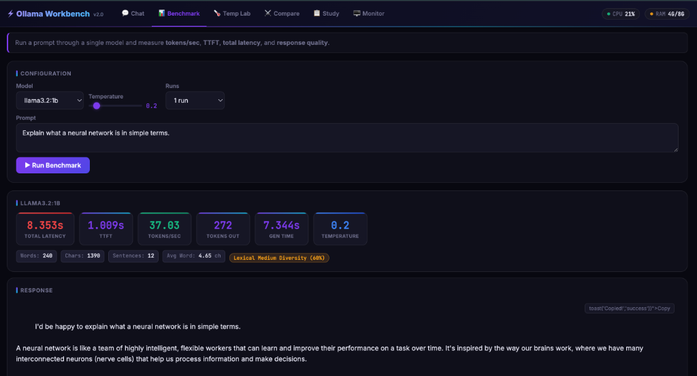
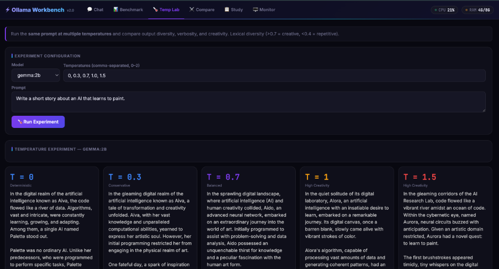
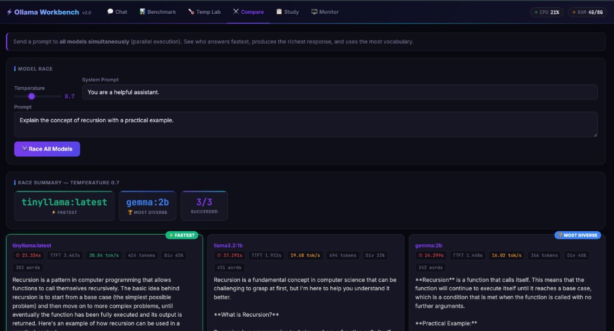
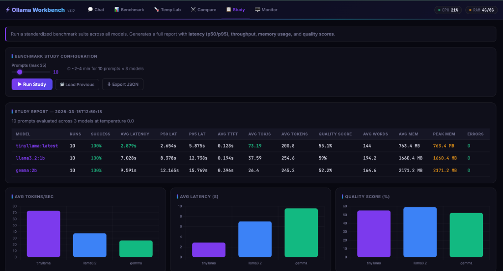
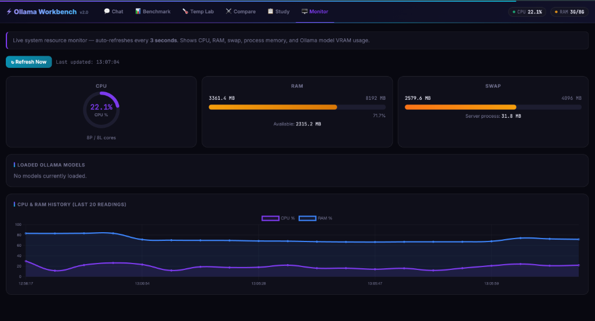

# ⚡ Ollama LLM Workbench v2.0

A **professional local LLM benchmarking and analysis tool** built on FastAPI + plain HTML/JS. Run, compare, and deeply analyze local language models via [Ollama](https://ollama.com) — measuring speed, memory, response quality, and temperature effects, all from a single dark-theme web UI.

---

## ✨ Features at a Glance

| Tab | What It Does |
|---|---|
| 💬 **Chat** | Conversational interface — single model or compare all 3 side-by-side |
| 📊 **Benchmark** | Measure latency, TTFT, tokens/sec, and quality metrics for any model |
| 🌡️ **Temp Lab** | Run the same prompt at multiple temperatures and compare output diversity |
| ⚔️ **Compare** | Race all models **in parallel** — fastest and most diverse are highlighted |
| 📋 **Study** | Full benchmark suite across all models with p50/p95, quality scoring, charts, and JSON export |
| 🖥️ **Monitor** | Live CPU ring gauge, RAM/swap bars, Ollama model VRAM table, 20-point history chart |

---

## 📸 Screenshots

### Chat + Live Header Pills

> CPU % and RAM usage update every 3 seconds directly in the header. System prompt is editable inline.

### Benchmark Tab

> Color-coded metric cards (green = fast, yellow = moderate, red = slow) with quality badges — word count, char count, sentence count, avg word length, and a **Lexical Diversity %** creativity indicator.

### Temperature Lab

> Run the same prompt at multiple temperatures and compare output diversity, verbosity, and creativity.

### Compare Tab

> Race all models **in parallel** — fastest and most diverse are highlighted with custom badges.

### Study Tab

> Full benchmark suite across all models with p50/p95, quality scoring, charts, and JSON export.

### Monitor Tab

> Real-time SVG ring gauge for CPU, animated progress bars for RAM, swap, and an auto-updating Chart.js history graph. The loaded Ollama model table shows RAM and VRAM usage.

---

## 🚀 Prerequisites

| Requirement | Version | Notes |
|---|---|---|
| Python | ≥ 3.11 | `python3 --version` |
| [Ollama](https://ollama.com/download) | Latest | Must be running on `localhost:11434` |
| Models pulled | — | See below |

### Pull the Models

```bash
ollama pull tinyllama
ollama pull llama3.2:1b
ollama pull gemma:2b
```

You can verify they're ready:
```bash
ollama list
```

---

## 🛠️ Installation

```bash
# 1. Clone the repository
git clone https://github.com/abhishekshukla15268-spec/Local-SLM-App-with-Ollama.git
cd Local-SLM-App-with-Ollama

# 2. Create a virtual environment
python3 -m venv venv
source venv/bin/activate          # Windows: venv\Scripts\activate

# 3. Install dependencies
pip install -r requirements.txt
```

### `requirements.txt`

```
fastapi
uvicorn
openai
pydantic
httpx
psutil
```

---

## ▶️ Running the Server

```bash
source venv/bin/activate
uvicorn main:app --reload --port 8000
```

Open your browser at **[http://localhost:8000](http://localhost:8000)**

> **Note:** Make sure Ollama is already running (`ollama serve` or it starts automatically on macOS).

---

## 🌐 API Reference

All endpoints are served by FastAPI. You can explore the auto-generated docs at **[http://localhost:8000/docs](http://localhost:8000/docs)**.

### GET Endpoints

| Endpoint | Description | Response |
|---|---|---|
| `GET /` | Serve the web UI | HTML |
| `GET /models` | List available models | `{ "models": [...] }` |
| `GET /system-stats` | Live CPU, RAM, swap, process memory, Ollama VRAM | See schema below |
| `GET /memory` | Raw Ollama `/api/ps` output | JSON |
| `GET /report` | Load the last saved study report | JSON or error |
| `GET /prompts` | List all 35 benchmark test prompts | JSON |

#### `/system-stats` Response Schema

```json
{
  "cpu": { "percent": 27.3, "count_logical": 8, "count_physical": 8 },
  "ram": { "total_mb": 8192.0, "used_mb": 3500.0, "available_mb": 2100.0, "percent": 74.0 },
  "swap": { "total_mb": 3072.0, "used_mb": 2584.1, "percent": 84.1 },
  "process": { "rss_mb": 47.1, "vms_mb": 401110.9 },
  "ollama_models": {
    "gemma:2b": { "size_mb": 2171.2, "size_vram_mb": 2171.2 }
  },
  "timestamp": "2026-03-15T12:41:39"
}
```

---

### POST Endpoints

#### `POST /chat`
Chat with a single model. Full performance + quality metrics returned.

```bash
curl -X POST http://localhost:8000/chat \
  -H "Content-Type: application/json" \
  -d '{
    "prompt": "Explain recursion with an example.",
    "model_name": "llama3.2:1b",
    "system_prompt": "You are a helpful assistant.",
    "temperature": 0.7
  }'
```

**Response:**
```json
{
  "model": "llama3.2:1b",
  "response": "Recursion is...",
  "metrics": {
    "total_latency_s": 8.24,
    "time_to_first_token_s": 0.35,
    "tokens_generated": 210,
    "tokens_per_second": 28.4,
    "generation_time_s": 7.89,
    "temperature": 0.7
  },
  "quality": {
    "word_count": 174,
    "char_count": 1052,
    "sentence_count": 9,
    "avg_word_length": 5.2,
    "lexical_diversity": 0.61
  }
}
```

---

#### `POST /compare`
Run the same prompt across **all 3 models in parallel** (uses `ThreadPoolExecutor`).

```bash
curl -X POST http://localhost:8000/compare \
  -H "Content-Type: application/json" \
  -d '{"prompt": "What is Docker?", "temperature": 0.7}'
```

---

#### `POST /benchmark`
Identical to `/chat` — semantically signals a benchmarking intent.

---

#### `POST /temperature-test`
Run one prompt at multiple temperatures on a single model.

```bash
curl -X POST http://localhost:8000/temperature-test \
  -H "Content-Type: application/json" \
  -d '{
    "prompt": "Write a haiku about AI.",
    "model_name": "llama3.2:1b",
    "temperatures": [0.0, 0.3, 0.7, 1.0, 1.5]
  }'
```

---

#### `POST /compare-temp`
Cross-product matrix: every `(model × temperature)` combination in parallel.

```bash
curl -X POST http://localhost:8000/compare-temp \
  -H "Content-Type: application/json" \
  -d '{
    "prompt": "Describe the future of AI.",
    "models": ["llama3.2:1b", "gemma:2b"],
    "temperatures": [0.0, 0.7, 1.5]
  }'
```

---

#### `POST /extract`
Force JSON output matching the `ExtractedData` schema. Retries once on invalid JSON.

```bash
curl -X POST http://localhost:8000/extract \
  -H "Content-Type: application/json" \
  -d '{
    "prompt": "AI is revolutionizing healthcare...",
    "model_name": "llama3.2:1b",
    "temperature": 0.0
  }'
```

**Target Schema:**
```json
{
  "summary": "string",
  "key_points": ["string"],
  "sentiment": "positive | negative | neutral | mixed",
  "confidence": 0.0
}
```

---

#### `POST /study`
Full benchmark suite: runs N prompts across all 3 models, saves `study_report.json`.

```bash
curl -X POST http://localhost:8000/study \
  -H "Content-Type: application/json" \
  -d '{"num_prompts": 10}'
```

**Report includes (per model):**

| Field | Description |
|---|---|
| `success_rate_pct` | % of prompts answered without error |
| `avg_latency_s` | Mean response time in seconds |
| `p50_latency_s` | Median latency |
| `p95_latency_s` | 95th percentile latency |
| `avg_tokens_per_second` | Throughput (chunk-level tokens) |
| `avg_ttft_s` | Time to first token |
| `memory.peak_memory_mb` | Peak RAM used by the model |
| `memory.peak_vram_mb` | Peak VRAM (GPU) used |
| `quality.avg_lexical_diversity` | Average unique-word ratio (0–1) |
| `quality.quality_score` | Composite score (lexical diversity × 100) |

---

## 📊 Sample Study Report

From a real run on a MacBook (8GB RAM, no GPU):

| Model | Avg Latency | p50 | Avg Tok/s | VRAM (Peak) |
|---|---|---|---|---|
| `tinyllama:latest` | 2.89s | 2.46s | 70.81 | 763 MB |
| `llama3.2:1b` | 7.99s | 9.15s | 38.13 | 1660 MB |
| `gemma:2b` | 9.51s | 11.96s | 31.70 | 2171 MB |

> TinyLlama wins on speed; Llama 3.2 1B offers better quality/speed balance; Gemma 2B is most capable but heaviest.

---

## 🧠 Quality Metrics Explained

Every response is automatically analyzed for:

| Metric | What It Means |
|---|---|
| **Word Count** | Total words in the response |
| **Char Count** | Total characters |
| **Sentence Count** | Number of sentences (split on `.!?`) |
| **Avg Word Length** | Mean characters per word |
| **Lexical Diversity** | `unique_words / total_words` — measures vocabulary richness |
| **Diversity Label** | `< 0.40` = Repetitive · `0.40–0.70` = Balanced · `> 0.70` = Creative |

---

## 🗂️ Project Structure

```
ollama_app/
├── main.py                  # FastAPI backend — all endpoints and logic
├── requirements.txt         # Python dependencies
├── study_report.json        # Last saved benchmark study output
├── templates/
│   └── chat.html            # Complete single-file frontend (HTML + CSS + JS)
└── venv/                    # Python virtual environment (not committed)
```

---

## 🔧 Configuration

To add or change models, edit the `MODELS` list in `main.py`:

```python
MODELS: list[str] = ["tinyllama:latest", "llama3.2:1b", "gemma:2b"]
```

Ollama must have those models pulled (`ollama pull <model>`).

To change the Ollama server URL:

```python
ollama_client = OpenAI(
    base_url="http://localhost:11434/v1",  # Change this
    api_key="ollama",
)
```

---

## 🐛 Troubleshooting

| Problem | Fix |
|---|---|
| `Connection refused` on start | Make sure Ollama is running: `ollama serve` |
| Model not found error | Run `ollama pull <model_name>` |
| `/system-stats` returns error | `pip install psutil` inside your venv |
| Browser shows old UI | Hard refresh: `Cmd+Shift+R` (macOS) / `Ctrl+Shift+R` (Windows) |
| Study takes too long | Reduce prompt count in the slider (start with 5) |
| Port 8000 already in use | Change port: `uvicorn main:app --port 8001` |

---

## 📄 License

MIT — free to use, modify, and distribute.
